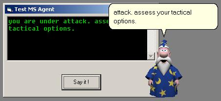



## MS Agent Class wrapper and test app

### Description

This is a handy wrapper class for the Microsoft Agent API. By adding this class to a VB project, you instantly add and totally control an MS agent charater to your app. All important functionality for controlling an MS Agent character is handled by the class. So customization is right there for you. Just play around with the class. The class comes with a little app to demonstrate its use. The focus of the class's feature set is for text-to-speech functionality. Another benefit is that you don't need to reference or use an OCX in your VB project. All calls and references are made directly to the MS Agent DLL. Event sinks are provided for in the class. OO concepts of encapsulation and delegation are used throughout. All objects are early bound. Important parameters are initialized for you. The class is well commented and is suitable for motivated beginners trying to figure out how to control those pesky little characters.

Best wishes
 
### More Info
 
The class is designed to be self-contained. You can plug it into any VB or VBA project to add MS Agent functioanlity to that app in less than 60 seconds !!! I guarantee it.

'

----

Developer Requirements: (win2K and XP have these)

'

----

' Requires SAPI 4: http://activex.microsoft.com/activex/controls/sapi/spchapi.exe

' Requires install of MS Agent DLL and *.acs" agent file(s).

' http://www.microsoft.com/msagent/downloads.htm

' VB Project needs reference to AgentCtl.DLL. "Microsoft Agent Control 2.0"

' You do *not* need the OCX in the toolbox or on a form !

'

----

After the download, open up the class (CAgent) code window for instructions, or just run the app. If the app doesn't work right away, you need to download and install the MS Agent runtime files. I / PSC *cannot* legally distribute those.

The key files to look for include:

AgentCtl.DLL (= active X DLL)

AgentMpx.DLL

Merlin.acs (= character file)

Genie.acs (= character file)

Robby.acs (= character file)

Peedy.acs (= character file)

'

----

KEY TIP

' VB Project *needs* reference to AgentCtl.DLL. "Microsoft Agent Control 2.0"

'

----

One of those little "characters" should pop up immediately and start talking when you run the app.

             |
---                |---
**Submitted On**   |2003-01-08 14:45:56
**By**             |[chris fitzmartin](https://github.com/Planet-Source-Code/PSCIndex/blob/master/ByAuthor/chris-fitzmartin.md)
**Level**          |Intermediate
**User Rating**    |4.2 (21 globes from 5 users)
**Compatibility**  |VB 4\.0 \(32\-bit\), VB 5\.0, VB 6\.0, VBA MS Access, VBA MS Excel
**Category**       |[Libraries](https://github.com/Planet-Source-Code/PSCIndex/blob/master/ByCategory/libraries__1-49.md)
**World**          |[Visual Basic](https://github.com/Planet-Source-Code/PSCIndex/blob/master/ByWorld/visual-basic.md)
**Archive File**   |[MS\_Agent\_C152605182003\.zip](https://github.com/Planet-Source-Code/chris-fitzmartin-ms-agent-class-wrapper-and-test-app__1-42275/archive/master.zip)

